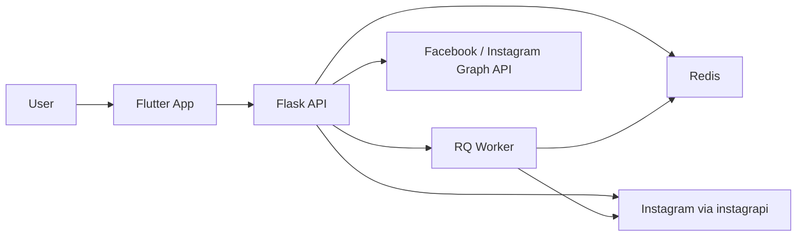
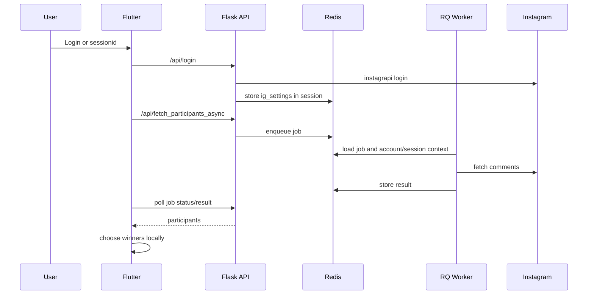
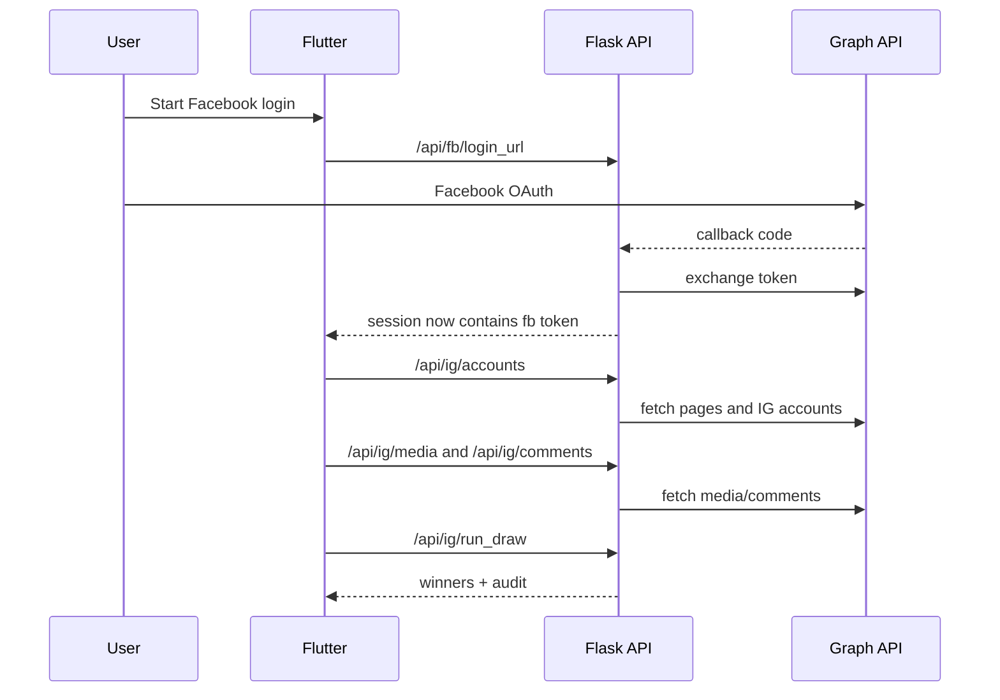

# giveaway_app Architecture

## Purpose

This document describes the current architecture of `giveaway_app` as it exists today.

Its goals:

- explain how the system is split between Flutter and Flask;
- show the two main business flows;
- document the operational dependencies;
- identify current weak spots and technical debt;
- make future cleanup and refactoring easier.

This is a living document. It should be updated when the main flows, entrypoints, storage model, or deployment assumptions change.

## System Overview

`giveaway_app` is a client-server system for running Instagram giveaways.

It has:

- a Flutter client for login, navigation, selection, and draw UI;
- a Flask backend for auth, session storage, integrations, and async jobs;
- Redis for Flask sessions, background queues, and account/proxy state;
- RQ workers for asynchronous participant fetching;
- two integration paths into Instagram data:
  - official `Facebook / Instagram Graph API`
  - session-based `instagrapi`

## High-Level Shape

## Main Runtime Components

### 1. Flutter Client

Primary entrypoint:

- [lib/main.dart](/Users/starlord/giveaway_app/lib/main.dart)

Main responsibilities:

- initialize app configuration from `.env`;
- initialize the shared API client;
- restore auth mode from local storage;
- route the user into the correct flow;
- render UI for login, media selection, comments, participants, and draw results.

Important app-level elements:

- `localeProvider`
  stores active locale
- `authStateProvider`
  checks server session and local auth mode during startup
- `ApiClient`
  shared Dio instance with persistent cookie storage

### 2. Flask API

Primary entrypoint:

- [api/main.py](/Users/starlord/giveaway_app/api/main.py)

Main responsibilities:

- manage Flask sessions in Redis;
- expose auth, debug, admin, and Instagram endpoints;
- handle Facebook OAuth and Graph API access;
- handle Instagram session login through `instagrapi`;
- enqueue async participant fetch jobs;
- expose account/proxy management endpoints.

### 3. Redis

Redis is a central runtime dependency, not an optional add-on.

It is used for:

- Flask server-side sessions;
- RQ job queue state;
- account/proxy affinity records;
- some short-lived cache entries.

Without Redis, the app loses:

- persistent backend auth sessions;
- async fetch processing;
- admin account/proxy state.

### 4. RQ Worker

Primary worker logic:

- [api/tasks.py](/Users/starlord/giveaway_app/api/tasks.py)

Responsibilities:

- restore session-based Instagram client settings;
- fetch comments asynchronously;
- return participant pools;
- run account-scoped jobs for affinity-managed accounts.

## Main Business Flows

## A. Facebook / Instagram Graph API Flow

Purpose:

- support Instagram business or creator accounts connected through Facebook.

Primary path:

1. Flutter asks backend for `/api/fb/login_url`
2. user completes Facebook OAuth
3. backend stores `fb_user_token` in Flask session
4. Flutter loads `/api/ig/accounts`
5. user chooses account and media
6. Flutter requests comments and runs draw/filter operations through Graph-backed endpoints

Main endpoints:

- `/api/fb/login_url`
- `/api/fb/callback`
- `/api/ig/accounts`
- `/api/ig/media`
- `/api/ig/resolve_media`
- `/api/ig/comments`
- `/api/ig/comments_all`
- `/api/ig/comments_filter`
- `/api/ig/run_draw`
- `/api/ig/export_csv`

Why this flow exists:

- it is the cleaner and more official path for supported account types;
- it supports filtered and auditable draw results.

Main Flutter screens involved:

- [lib/screens/login/app_login_screen.dart](/Users/starlord/giveaway_app/lib/screens/login/app_login_screen.dart)
- [lib/screens/fb_home_screen.dart](/Users/starlord/giveaway_app/lib/screens/fb_home_screen.dart)
- [lib/screens/ig_media_screen.dart](/Users/starlord/giveaway_app/lib/screens/ig_media_screen.dart)
- [lib/screens/ig_comments_screen.dart](/Users/starlord/giveaway_app/lib/screens/ig_comments_screen.dart)

## B. Instagram Session / instagrapi Flow

Purpose:

- support cases where Graph API is not available or not sufficient.

Primary path:

1. Flutter collects device fingerprint
2. Flutter posts device info to `/api/collect_device_geo` and `/api/device_report`
3. Flutter submits credentials to `/api/login`
4. backend logs into Instagram through `instagrapi`
5. backend stores `ig_settings` in Flask session
6. Flutter starts `/api/fetch_participants_async`
7. backend enqueues an RQ job
8. Flutter polls job status and result endpoints
9. Flutter locally selects winners from the returned participant pool

Main endpoints:

- `/api/collect_device_geo`
- `/api/device_report`
- `/api/login`
- `/api/session_status`
- `/api/fetch_participants_async`
- `/api/job_status/<job_id>`
- `/api/job_result/<job_id>`
- `/api/login_by_sessionid`
- `/api/logout`

Main Flutter screens involved:

- [lib/screens/login/app_login_screen.dart](/Users/starlord/giveaway_app/lib/screens/login/app_login_screen.dart)
- [lib/screens/password_login_screen.dart](/Users/starlord/giveaway_app/lib/screens/password_login_screen.dart)
- [lib/screens/instagram_login_webview.dart](/Users/starlord/giveaway_app/lib/screens/instagram_login_webview.dart)
- [lib/screens/login/participants_screen.dart](/Users/starlord/giveaway_app/lib/screens/login/participants_screen.dart)

Operational note:

- this flow depends on both Flask session persistence and a running RQ worker.

## C. Account Affinity / Admin Flow

Purpose:

- support multi-account operational management on the backend.

This flow introduces persisted backend-side records for:

- Instagram accounts;
- proxy endpoints;
- account-to-proxy binding;
- account-scoped participant fetch jobs.

Primary endpoints:

- `/api/admin/proxies`
- `/api/admin/accounts`
- `/api/admin/accounts/from_current_session`
- `/api/admin/accounts/from_sessionid`
- `/api/admin/accounts/<account_id>`
- `/api/admin/accounts/<account_id>/bind_proxy`
- `/api/admin/accounts/<account_id>/sync_session`
- `/api/admin/accounts/<account_id>/fetch_participants_async`

Core storage implementation:

- [api/account_affinity.py](/Users/starlord/giveaway_app/api/account_affinity.py)

Why this matters:

- this is the foundation for scaling beyond a single active session;
- it separates operational backend accounts from only the currently logged-in user session.

## Client Architecture

### Startup And Routing

The app startup logic lives in [lib/main.dart](/Users/starlord/giveaway_app/lib/main.dart).

The current startup model:

1. load `.env`
2. initialize `ApiClient`
3. inspect locally stored `auth_method`
4. validate the corresponding backend session or account state
5. route to:
   - login screen
   - Facebook home flow
   - participants flow

Supported auth modes currently visible in startup logic:

- `fb`
- `ig`
- `ig_account`

### Client Services

Main client services:

- [lib/services/api_client.dart](/Users/starlord/giveaway_app/lib/services/api_client.dart)
  shared Dio client and persistent cookies
- [lib/services/device_service.dart](/Users/starlord/giveaway_app/lib/services/device_service.dart)
  collects device fingerprint and asks backend to emulate a device profile
- [lib/services/graph_service.dart](/Users/starlord/giveaway_app/lib/services/graph_service.dart)
  Graph API related calls via backend
- [lib/services/auth_service.dart](/Users/starlord/giveaway_app/lib/services/auth_service.dart)
  session-based auth flow
- [lib/services/appapi/app_auth_service.dart](/Users/starlord/giveaway_app/lib/services/appapi/app_auth_service.dart)
  newer app/admin-oriented auth path
- [lib/services/participants_service.dart](/Users/starlord/giveaway_app/lib/services/participants_service.dart)
  older participant fetch path
- [lib/services/appapi/app_participants_service.dart](/Users/starlord/giveaway_app/lib/services/appapi/app_participants_service.dart)
  account-aware participant fetch path

Important observation:

- there is overlap between old and new service layers;
- naming is currently ambiguous because some old and new classes share the same class names.

### Client State And Storage

Client-side persistent state currently relies on:

- `SharedPreferences`
  - `auth_method`
  - `active_account_id`
  - `isLoggedIn` in some flows
- persistent cookie jar for backend cookie-based session continuity

## Backend Architecture

### Session Model

The backend uses Flask server-side session storage backed by Redis.

Session keys currently used include:

- `ig_settings`
- `emu_cache`
- `fb_user_token`
- `ig_graph_settings`

This means:

- the mobile/web client does not hold Instagram session internals directly;
- the backend owns the working session state and reuses it across requests.

### Integration Modules

Relevant backend files:

- [api/main.py](/Users/starlord/giveaway_app/api/main.py)
  primary API surface and orchestration
- [api/fb_graph.py](/Users/starlord/giveaway_app/api/fb_graph.py)
  Facebook Graph helper module
- [api/tasks.py](/Users/starlord/giveaway_app/api/tasks.py)
  RQ worker logic
- [api/device_emulator.py](/Users/starlord/giveaway_app/api/device_emulator.py)
  converts raw client device payload into a backend-ready device profile

### Deployment Shape

Signals currently present in repo:

- [api/Procfile](/Users/starlord/giveaway_app/api/Procfile) defines separate `web` and `worker` processes
- [api/Dockerfile](/Users/starlord/giveaway_app/api/Dockerfile) defines a web image using Gunicorn
- [railway.json](/Users/starlord/giveaway_app/railway.json) points Railway to `api/Dockerfile`

Current conclusion:

- deployment intent is clear;
- deploy path is aligned around `railway.json -> api/Dockerfile -> main:app`.
- `api.main:app` in [api/Procfile](/Users/starlord/giveaway_app/api/Procfile) and `main:app` in [api/Dockerfile](/Users/starlord/giveaway_app/api/Dockerfile) are consistent because the container copies `api/` contents into `/app`.

## Data And Control Flow Notes

## Session-Based Draw Flow

## Graph API Draw Flow

## Current Weak Spots

These are architecture-level issues, not just random code defects.

### 1. Mixed Generations Of Client Services

There are parallel service layers for auth and participant loading.

Examples:

- [lib/services/auth_service.dart](/Users/starlord/giveaway_app/lib/services/auth_service.dart)
- [lib/services/appapi/app_auth_service.dart](/Users/starlord/giveaway_app/lib/services/appapi/app_auth_service.dart)
- [lib/services/participants_service.dart](/Users/starlord/giveaway_app/lib/services/participants_service.dart)
- [lib/services/appapi/app_participants_service.dart](/Users/starlord/giveaway_app/lib/services/appapi/app_participants_service.dart)

Impact:

- harder onboarding;
- harder refactoring;
- higher risk of routing a screen through the wrong abstraction.

### 2. Screen Layout Reflects Historical Evolution

There are old and newer screen groupings in:

- `lib/screens/`
- `lib/screens/login/`

Impact:

- the runtime behavior is understandable, but the ownership boundaries are unclear.

### 3. One Very Large Backend Entry File

[api/main.py](/Users/starlord/giveaway_app/api/main.py) currently acts as:

- auth controller;
- Graph API controller;
- admin controller;
- async orchestration layer;
- debug surface;
- static/legal surface.

Impact:

- high cognitive load;
- harder testing and ownership boundaries;
- easy to create accidental coupling.

### 4. Documentation And Runtime Structure Diverged

The repository already has real operational complexity, but until now it did not have matching human-facing documentation.

Impact:

- context is lost between chats;
- knowledge remains implicit;
- refactoring becomes riskier than necessary.

### 5. Deployment Config Is Not Yet Cleanly Normalized

The current repo indicates more than one deployment assumption.

Impact:

- local setup and production setup may drift;
- new contributors will need manual interpretation.

## Recommended Cleanup Direction

This is not a refactor plan yet. It is the intended architectural direction.

### Short Term

- keep `README` and `PROJECT_SUMMARY_FOR_CHAT` current;
- maintain this architecture document as the system map;
- identify the canonical service layer for auth and participants;
- document which screens are active and which are legacy;
- normalize local run instructions and deploy assumptions.

### Medium Term

- split backend modules by domain:
  - auth/session
  - graph
  - admin/accounts/proxies
  - jobs
- consolidate duplicated client services;
- define a cleaner app navigation ownership model.

### Long Term

- make the Graph flow and session-based flow explicit product modes with cleaner separation;
- define a deliberate test strategy around those modes;
- treat account affinity as a first-class subsystem, not just attached admin routes.

## Files To Read First

If someone needs to understand the system quickly, start here:

1. [README.md](/Users/starlord/giveaway_app/README.md)
2. [PROJECT_SUMMARY_FOR_CHAT.md](/Users/starlord/giveaway_app/PROJECT_SUMMARY_FOR_CHAT.md)
3. [lib/main.dart](/Users/starlord/giveaway_app/lib/main.dart)
4. [api/main.py](/Users/starlord/giveaway_app/api/main.py)
5. [api/tasks.py](/Users/starlord/giveaway_app/api/tasks.py)
6. [api/account_affinity.py](/Users/starlord/giveaway_app/api/account_affinity.py)

## Update Rule

Update this file when any of the following changes:

- main auth flow;
- routing structure;
- session model;
- Redis/RQ usage;
- Graph API integration shape;
- account/proxy model;
- deployment assumptions.
